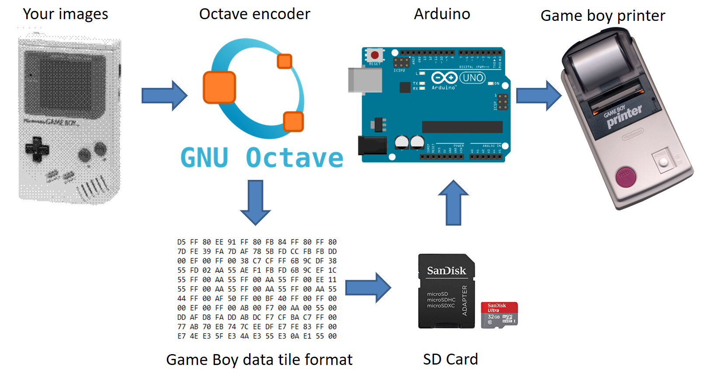

# The Arduino SD Game Boy Printer

## Print everything you want with your Game Boy Printer from SD card !

Why ? I've tried many other codes aiming to use Arduino to take control of the printer without been able to do anything. So let's waste a day to do something that works !

This project provides an easy solution to hack the Game Boy Printer. You just need to load a file on SD card and print (after some wiring) ! The code is divided into two parts : a converter ran with GNU Octave to encode any batch of PNG images into a tile format, and an arduino code that interprets this tile format into Game Boy Printer protocol and sends it to the printer, from an SD card.

Note: a derivative of this code also serves as add-on for the [GBCamera-Android-Manager](https://github.com/Raphael-Boichot/GBCamera-Android-Manager). A version allowing [direct printing from PC through the Arduino](https://github.com/Raphael-Boichot/PC-to-Game-Boy-Printer-interface) is also available.

## Parts needed

- An [Arduino Uno](https://fr.aliexpress.com/item/32848546164.html);
- A [generic SD shield](https://fr.aliexpress.com/item/1005001621978057.html) of any kind (some soldering or breadboard required). **Important note:** I do not recommend using a pre-built Arduino SD shield as CS pin may be pin D4 which interfers with SOUT. Also the CS pin may not be indicated on the board, which is stupid.
- The [cheapest Game Boy serial cable you can find](https://fr.aliexpress.com/item/32698407220.html) as you will cut it. **Important note:** SIN and SOUT are crossed internally so never trust what wires you get. Use a multimeter to identify wires. Cross SIN and SOUT if the device does not work at the end.
- If you want something clean, you may use a [serial port breakout board](https://github.com/Palmr/gb-link-cable) instead of cutting/soldering a cable.

## Pinout with a generic SD shield

## How to use it

- Install the [Arduino IDE](https://www.arduino.cc/en/software) and [GNU Octave](https://octave.org/);
- Clone the repo locally;
- Flash the [Arduino code](https://github.com/Raphael-Boichot/The-Arduino-SD-Game-Boy-Printer/blob/master/Game_Boy_SD_printer/Game_Boy_SD_printer.ino) to your Arduino Uno;
- Drop some images, **any size, any number of colors, png format**, in the ./Image_converter/Images folder. 1x screenshots, 4 colors, made from emulators and images from Game Boy Camera fit perfectly the native printer resolution but are not mandatory. Other formats will be reduced to 160x(16xX), 2 bits per pixel images, Bayer dithering (like the Game Boy Camera);
- Convert images in Game Boy tile format running the [converter](https://github.com/Raphael-Boichot/The-Arduino-SD-Game-Boy-Printer/blob/master/Image_converter/Image_converter.m);
- Copy the Hex_data.txt generated on an SD card formatted in FAT32, transfer card to the SD shield;
- Connect the Game Boy Printer to the Arduino and the Arduino to the PC. Nothing indicates if wiring is OK, trust yourself;
- Enjoy your washed-out pictures !
- It does not work ? Inverse SIN and SOUT and check again for CS pin number, then retry !

By opening the Arduino.serial at 115200 bauds, you can track the protocol used, from Arduino or Game Boy printer point of view, during the whole printing process. Details of the image to tile transformation which is a bit tricky are exposed [here for example](https://blog.flozz.fr/2018/11/19/developpement-gameboy-5-creer-des-tilesets/). Explanations about the Game Boy Printer protocol can be found [here](https://gbdev.gg8.se/wiki/articles/Gameboy_Printer), [here](http://furrtek.free.fr/?a=gbprinter) or [here](https://www.mikrocontroller.net/attachment/34801/gb-printer.txt).

Concerning the printing intensity, I use the default printing intensity of 0x40 (0x80 to 0xFF are also default), but you can use darker or softer print by commenting/decomenting [these lines](https://github.com/Raphael-Boichot/The-Arduino-SD-Game-Boy-Printer/blob/5ccbeceb39912a4f920be82870afb94bbc8a396c/Game_Boy_SD_printer/Game_Boy_SD_printer.ino#L35-L37). Be carefull, for each byte you will modify to play with other commands, you also have to change the checksum (LSB first !).

## Summary

## The protocol used

The protocol coded into the Arduino is the following :

The protocol is a little bit simplier than the one used classically by the Game Boy. 9 blocks of data containing 40 tiles (2 rows of 20 tiles, 160x16 pixels) are loaded into the 8 ko internal memory before printing (less for the last remaining packets), one after the other. The inquiry command to check if the printer is busy is just replaced by a 1200xnumber of packets delay (ms), approximate time to print data stored in printer memory. I call the inquiry command every 1200 ms, but for fun. The protocol is fully open loop, the Arduino does not mind wether the serial cable is connected or not). The response bytes of the printer are anyway captured. Printer says "0x81" (10000001) in the first response byte if it is alive, and some other informations in the second byte. To see what the printer really says, or what the Arduino realy sends, change the value on [this line](https://github.com/Raphael-Boichot/The-Arduino-SD-Game-Boy-Printer/blob/5ccbeceb39912a4f920be82870afb94bbc8a396c/Game_Boy_SD_printer/Game_Boy_SD_printer.ino#L27).

Globally, the code is very optimized to allow buffering of one data packet into the tiny Arduino Uno memory. I cannot add more live comment or additionnal feature without impeding the stability. I did not use the margin option of the print command, I rather fill the Hex_data.txt file with 3 blanck packets between each image. It allows you to visualize the limit between images in the Game Boy tile formatted data and it allows me to just send raw packets on the SD card without dedicated extra commands to separate the images (and without updating the checksums again which is a pain in the arse).

## Some random technical facts

Most of the printers comes with a Toshiba TMP87CM40AF 8-bits MCU that contains 8 kbytes rom data. The printer also has a variant motherboard with a NEC MCU (the rom data are probably the same than the ones of Toshiba), 512 bytes of internal ram and 8 kbytes of ram extension but this custom NEC microcontroller is very poorly documented. I've added some documentation about the Toshiba MCU into the repo as well as a dump of the TMP87CM40AF of a dead Game Boy Printer made by [cristofercruz](https://github.com/cristofercruz).

The printers come with serial number begining by PH (Hosiden) or PS (Seiko), corresponding to two manufacturers (not sure if this is related to MCU used). Hosiden models are known to be quite finicky on printing timings contrary to Seiko ones. Hosiden requires about 100 ms between end of packet transmission and printing command to process data while Seiko looks faster to perform the same task. Overall, a code bitbanging an Hosiden with success will work on Seiko, not the contrary.

Some other informations : there is a maximum of 1.49 ms delay allowed between bytes into a packet. If the delay between two bytes is longer than this, the whole packet is simply rejected. This is why the code does not read directly from SD card and use a data packet buffer. Reading directly to SD card and sending bytes is too unstable to ensure that the critical delay of 1.49 ms between bytes is respected. The instability is due to the stalling of the reading process on SD card when jumping from one sector to another. I've made the direct reading on SD card possible in early versions of the code by forcing the file format (with the image decoder) to be one data packet per sector (stuffing SD card sectors with garbage bytes after each data packet so that a packet exactly matched the sector size). Honestly, it is a bit overkill for this kind of tool. It would also oblige the user to use a specific sector size when formating SD card. So I implemented the buffering, more generic, more stable. 

The INIT command is valid at least 10 seconds, but the other packets themselves have a shorter lifespan of about 110 ms if they are not followed by another packet. I used this 110 ms delay to read on the SD card and fill the data packet buffer in Arduino memory. Hopefully the process of buffering is short enough to stay below the lifespan of preceding packet.

## Unexpected properties of the 0F and 04 commands

By messing with the printer protocol, I've discovered two things that are not clearly indicated into the Game Boy programming manual:

- *On one hand, INQUIRY packet (command 0x0F) systematically resets the status bit "unprocessed data" of the printer to 0, whatever the moment it is called (before or after printing). This should indicate that real games do not mind the status of the printer concerning this particular error bit as 0x0F command can be called anytime in the protocol.*
- *On the other hand, an empty DATA packet (command 0x04 with 0 load) systematically set the status bit "image data full" to 1, which seems to be a mandatory triggering interrupt for printing, whatever the state of the other status bits or printer memory filling (1 to 9 data packet stored in memory leads to the same status). I think that "image data ready" or "end of transmission" would be more appropriate than "image data full" as bit name...*

These particularities should be included in any printer emulator to ensure a 100% compatibilty with games.

## Where to buy 38 mm thermal paper for the Game Boy Printer ?

I do not recommend cutting wider roll of thermal paper (risk of frequent paper jam, crappy result) or buying outdated old Nintendo stocks as the results will be deceptive (faint printing on yellowish paper). Any fresh 38 mm wide thermal paper will do the job. In Europe, [Quorion](https://www.quorion.com/products/accesories/receipt-rolls/) produces 38 mm thermal paper and sells via Amazon. [Tillrollking](https://www.tillrollking.co.uk/thermal-rolls) sells 38 mm thermal paper roll (seen on [Reddit](https://www.reddit.com/r/Gameboy/comments/d2sq77/game_boy_printer_paper_alternative/)). [Nakagawa Manufacturing](https://www.onlinecomponents.com/en/nakagawa-manufacturing/nap0038006-12002055.html) also produced the NAP-0038-006 thermal paper which is 38 mm wide. **In asia, very good results could be obtained with 38 mm [SEIKO S-951 thermal paper](https://mignon.hateblo.jp/entry/2021/07/01/003119).** This paper is used for the professional Stop Watch series sold by the same company. This paper could be obtained from Japan for cheap if you have a local contact or from western suppliers of sport equipments for a shameful price, but hey, science has no price ! Just remind that Seiko was the main manufacturer of the Game Boy printer head. I did not find any cheap chinese supplier for the moment. It seems that the 38 mm thermal paper is used by taxi cashier machine also.

Last but not least, Europe banned BPA (Bisphenol A) from thermal paper for good reasons, so avoid dispersing this kind of persistant chemical by buying BPA free paper. 
In any case, for making quick test, development, hacks, etc., some cropped used cashier tickets do the job.

## Now have fun with it !

